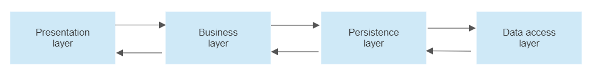

# Financial Transaction Management and Reporting

#### This microservice is designed using Spring Boot, JPA and H2 database (internally Hibernate ORM, Tomcat web server). This has several layers like controller, service, repository and data storage. Controller layers are interacting with service layer which talk to the repository layers and finally repository layers are talk to database storage for desired action. Maven is used for this project, and pom.xml file will have all project dependencies.

#### Data is storing using the `TransactionDetails.java` data model class, where JPA annotations has been used for bindings with datable table and columns.

#### NOTE: For assignment purpose I used H2 database, for production different storage should be picked based of data capacity and usage. In accordance of storage choice persistence layer implementation will be changed.

#### Design wise Sprint Boot for developing microservices is one of the good choices for several reasons. It gives clean architecture, simplified development process, facilitates creation and testing with unit and integration tests, easy connectivity with various databases.

## Project Configuration

This Spring boot  project can be generated using the [spring initializr](https://start.spring.io) or from your IDE.

**GroupId:** com.mhk.demo

**Artifact:** transaction-service

**Name:** transaction-service

**Description:** Demo project for financial transaction record

**Java version:** 17 (you can choose different Java version as well)

**Packaging:** war

**Dependencies:** Add necessary dependencies during project creation, you can add a new dependency manually at later point.

## How to run this service?

#### **IDE** - Open the project folder from IntelliJ IDEA and configure your run/debug configuration with entry point `Application.java` class.

#### **CLI** - From command-line use `mvn spring-boot:run` you need to set maven home in the system environment. 

## Architecture

#### This implementation is loosely coupled solution where presentation, business, persistence and data storage layers are four layers which are described below. One of the main advantage is it is not necessary to declare DAO (Data Access Object) and DAOImpl classes. The entry point of this is the `@SpringBootApplication` and the main method in the `Application.java` class.



#### **Presentation layer** - on this layer controllers receive HTTP requests from the client and send to the next layer after authenticated. After all the way of all other layers back to it and it responds to the frontend.

#### **Business layer** - this layer handles the business logic. This layer contains service classes and performs authorization and validation.

#### **Persistence layer** - it contains the storage logics and translates business objects into database rows. However, in this layer it can also interact with other form of storage e.g. file system or JSON/XML. 

#### **Data access layer** - this layer performs CRUD (Create, Retrieve, Update and Delete) operations.

## Services / Functionalities

#### - Payment Service

#### This service will help to record and retrieve the transaction details, default currency is SAR (Saudi Riyal). Additionally, during transaction retrieval client can make request to represent the actual amount in USD where are static conversion rate is used to convert the amounts from SAR to USD. Here are the API endpoints described:

`HTTP POST: http://localhost:8080/api/v1/payment` with payload to store a transaction.

Sample payload:
```
{
  "orderId": 1,
  "amount": 100,
  "referenceNumber": 1,
  "paymentMode": "CASH"
}
```

`HTTP GET: http://localhost:8080/api/v1/payment/order/:orderId?currency=usd` to retrieve.

#### - Report Service

#### With this service client can get simple reporting for instance the total transactions count and total amount in SAR and USD.

`HTTP GET: http://localhost:8080/api/v1/report` to get simple report.

#### NOTE: Where actual baseURL with `host:port` will be used in production. 